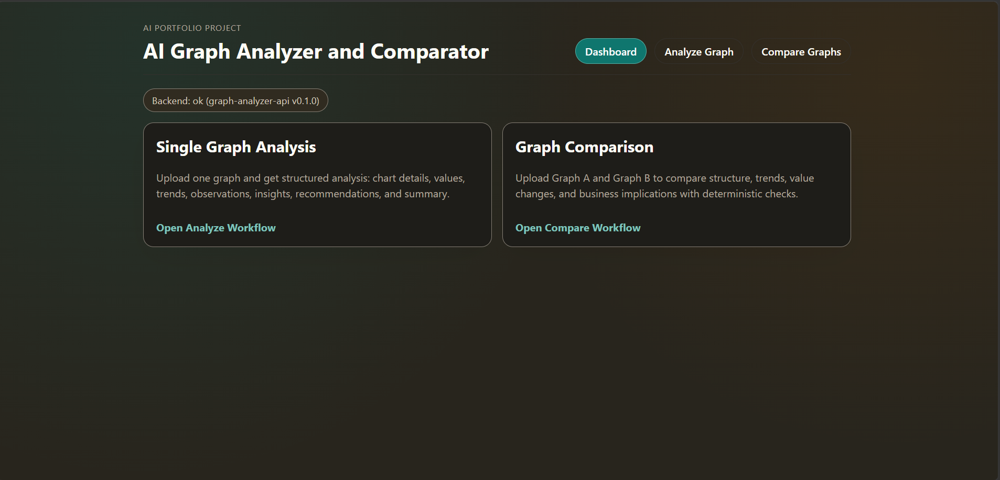
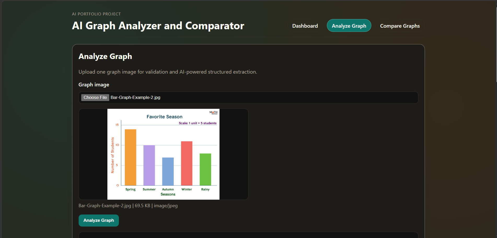
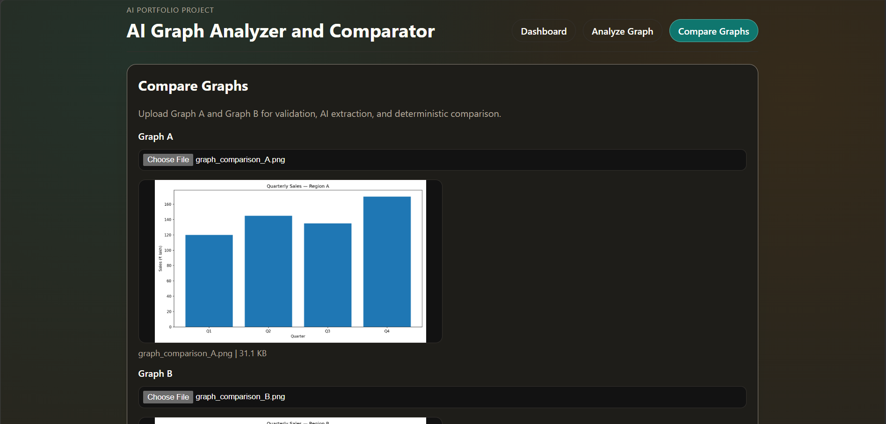

# AI Graph Analyzer & Comparator

A full-stack AI application that reads chart images and turns them into structured,
verifiable analysis. Upload one chart to get a detailed breakdown, or upload two to
get a side-by-side comparison. A Groq multimodal model extracts structured facts
from each image, a deterministic engine computes the numeric differences, and the AI
then interprets those computed facts — so the numbers are real and only the narrative
is generated.

## Live Links

- Live Demo: https://graph-analyzer.onrender.com
- API Documentation: https://graph-analyzer-api.onrender.com/api/docs

## Screenshots

| Dashboard | Single Analysis | Comparison |
|-----------|-----------------|------------|
|  |  |  |

## Overview

The application has two workflows:

**Single Graph Analysis** — one chart image in, one structured analysis out: graph
type, axes, highest and lowest values, trends, observations, business insights,
recommendations, and a summary, with explicit uncertainty handling.

**Graph Comparison** — two chart images in. Each is analyzed independently, a
deterministic engine computes the structural and numeric differences, and the AI
interprets those computed facts into comparative insights, recommendations, and a
summary. When the two charts are not numerically comparable (different units, types,
or categories), the response says so explicitly instead of inventing numbers.

## Features

- Structured extraction of graph type, axis labels, and units.
- Highest and lowest values with their labels and confidence.
- Maximum and minimum trend descriptions.
- Observations, business insights, and recommendations.
- A concise natural-language summary of the chart.
- Uncertainty handling — unknown numeric values are left null with a note rather than
  guessed.
- Comparison of similarities and differences across the two charts.
- Absolute and percentage change for comparable values.
- Trend comparison between the two charts.
- Detection of significant changes.
- Comparability checks that flag when two charts cannot be numerically compared.
- AI-generated comparative interpretation grounded in the computed facts.

## Why This Isn't Just an LLM Wrapper

The numbers in a comparison are never produced by the language model. The workflow
separates extraction, computation, and interpretation:

- The Groq multimodal model extracts **structured** information from each chart image
  (type, axes, values, trends) rather than free-form prose.
- A deterministic comparison engine calculates the numerical differences — absolute
  and percentage change, trend shifts, and significant changes — in plain code.
- The AI then interprets the **already-computed** comparison facts into readable
  insights; it does not invent or recalculate the numbers.
- Pydantic v2 validates every structured response, so malformed or partial model
  output is normalized instead of crashing the request.
- During the comparison interpretation step the raw images are not re-sent — only the
  structured, extracted facts are passed to the model.

This keeps the quantitative results deterministic and reproducible while still using
the model for the qualitative work it's actually good at.

## How It Works

Single graph analysis:

```
image
  -> validate (MIME / size / integrity)
  -> Groq multimodal extraction
  -> JSON normalization
  -> Pydantic validation
  -> structured analysis
```

Graph comparison:

```
image A + image B
  -> validate each
  -> Groq extracts a structured analysis of each
  -> deterministic engine computes the differences
  -> Groq interprets the computed facts (images not re-sent)
  -> Pydantic validation
  -> structured comparison + interpretation
```

## Tech Stack

**Backend:** Python, FastAPI, Uvicorn, Pydantic v2 / pydantic-settings, Pillow,
Groq Python SDK.

**Frontend:** React, TypeScript, Vite, React Router.

**AI:** Groq multimodal chat completions (`qwen/qwen3.6-27b`).

**Tooling & hosting:** GitHub, Render.

## Project Structure

```
graph-analyzer/
├── apps/
│   ├── backend/
│   └── frontend/
├── deployment/
│   └── render.yaml
├── docs/
│   ├── architecture.md
│   ├── api.md
│   └── screenshots/
├── .gitignore
├── .python-version
└── README.md
```

## API

Base URL in production: `https://graph-analyzer-api.onrender.com`

| Method | Path | Body | Description |
|--------|------|------|-------------|
| `GET`  | `/api/health` | — | Liveness check. Returns `{"status":"ok","service":"graph-analyzer-api","version":"0.1.0"}`. |
| `POST` | `/api/v1/analyze` | multipart, field `file` | Structured analysis of a single chart (PNG/JPEG/WebP). |
| `POST` | `/api/v1/compare` | multipart, fields `graph_a`, `graph_b` | Two analyses plus the computed comparison and AI interpretation. |

Interactive API documentation: https://graph-analyzer-api.onrender.com/api/docs

## Validation & Reliability

- MIME allow-list for uploads (PNG/JPEG/WebP).
- Upload size validation against a configurable limit.
- Pillow integrity check that rejects malformed or corrupt images.
- Pydantic v2 validation of every structured response.
- JSON normalization so partial or loosely-shaped model output is coerced into the
  expected schema instead of failing.
- Defensive JSON extraction as a fallback when parsing the model output.
- Uncertainty handling — unknown numeric values are left null with a note.
- Deterministic numerical comparison computed in code, not by the model.
- Structured logging for server-side diagnostics.
- Sanitized client errors — a global exception handler returns a generic message so
  stack traces and internal details never reach the client.
- The blocking Groq SDK call runs in a worker thread to keep the async event loop
  responsive.

## Local Development

Clone the repository:

```bash
git clone <your-repo-url>
cd graph-analyzer
```

Backend (from `apps/backend`):

```bash
cd apps/backend
python -m venv .venv
# Windows:      .venv\Scripts\activate
# macOS/Linux:  source .venv/bin/activate

pip install -r requirements.txt        # runtime
pip install -r requirements-dev.txt    # + pytest, httpx (for tests)

cp .env.example .env                   # Windows: copy .env.example .env
# edit .env and set GROQ_API_KEY

uvicorn app.main:app --host 0.0.0.0 --port 8000 --reload
```

Frontend (from `apps/frontend`):

```bash
cd apps/frontend
npm install

cp .env.example .env                   # Windows: copy .env.example .env
# edit .env and set VITE_API_BASE_URL (defaults to http://localhost:8000)

npm run dev                            # dev server on http://localhost:5173
```

## Testing

Backend tests (from `apps/backend`):

```bash
python -m pytest
```

Frontend type-check and production build (from `apps/frontend`):

```bash
npm run build
```

## Deployment

The backend runs as a **Render Web Service** and the frontend as a **Render Static
Site**. Backend configuration lives in `deployment/render.yaml` (build, start
command, and health check at `/api/health`). The frontend's `VITE_API_BASE_URL`
points at the deployed backend URL, and the backend's `CORS_ALLOWED_ORIGINS` allows
the deployed frontend origin. Secrets such as `GROQ_API_KEY` are set through
environment variables in the host, never committed.

## Environment Variables

Backend (`apps/backend/.env`, template in `apps/backend/.env.example`):

| Variable | Purpose | Default (dev) |
|----------|---------|---------------|
| `GROQ_API_KEY` | Groq API key. Read only from the environment. | *(none — required)* |
| `GROQ_MODEL` | Groq model id. | `qwen/qwen3.6-27b` |
| `APP_ENV` | Environment name. | `development` |
| `LOG_LEVEL` | Logging level. | `INFO` |
| `CORS_ALLOWED_ORIGINS` | Comma-separated allowed browser origins. | `http://localhost:5173` |
| `MAX_UPLOAD_MB` | Max upload size (MB). | `8` |
| `REQUEST_TIMEOUT_SECONDS` | Groq request timeout (seconds). | `45` |
| `PORT` | Provided by the host (e.g. Render). | `8000` locally |

Frontend (`apps/frontend/.env`, template in `apps/frontend/.env.example`):

| Variable | Purpose | Default (dev) |
|----------|---------|---------------|
| `VITE_API_BASE_URL` | Base URL of the backend API. | `http://localhost:8000` |

## Security

The `GROQ_API_KEY` is backend-only — it is never exposed to the frontend, never
hardcoded in source, and never committed. `.env` files are gitignored; only
`.env.example` templates are tracked.

## Documentation

- [API reference](docs/api.md)
- [Architecture](docs/architecture.md)

## Future Improvements

- Support for additional chart types and richer axis/series extraction.
- Batch analysis of multiple charts in one request.
- Exporting an analysis or comparison as a downloadable report.

## License

This is a personal portfolio project. No formal open-source license is currently
applied; please contact the author before reusing it.
